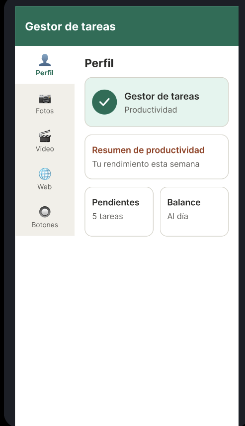
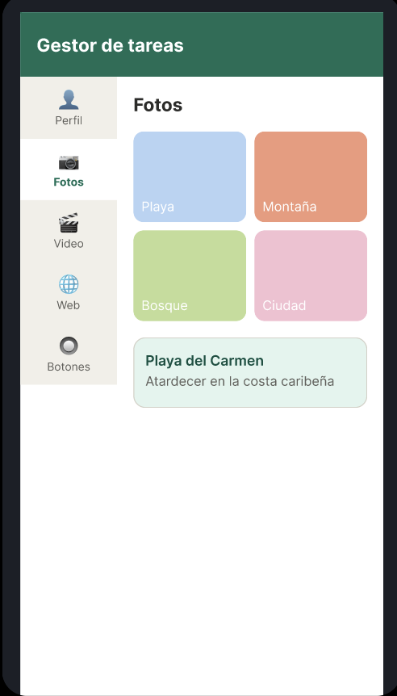
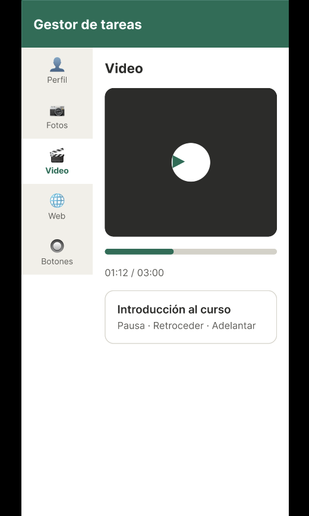
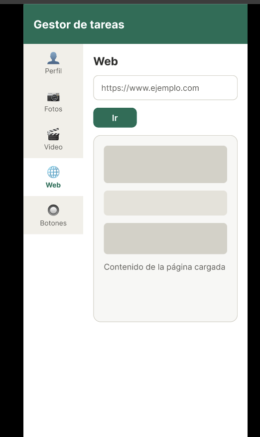
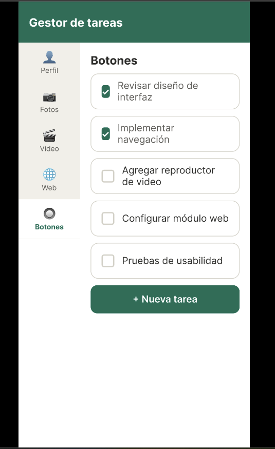
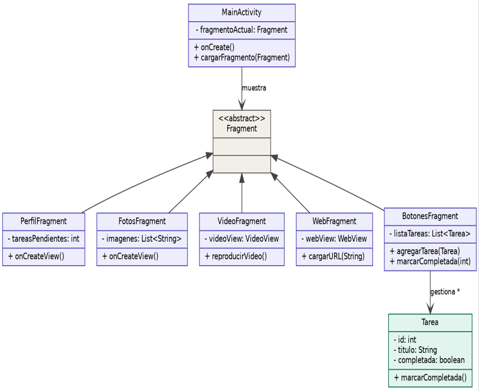

# 📱 PocketLife — Gestor de Tareas (Android)

Aplicación móvil para Android desarrollada con **actividades y fragmentos**, como proyecto del módulo **Herramientas de Programación Móvil 1** (Ingeniería de Software, Politécnico Grancolombiano).

- **Equipo:** G8-HPMB01-APKTasticos
- **Tutor:** Víctor Fabián Castro Pérez

## 👥 Integrantes

- David Quiroga Forero
- Duván Sebastián Tibaquirá González

---

## 📌 Descripción del proyecto

PocketLife es una aplicación con fines académicos que demuestra la integración de los principales componentes de una interfaz Android: fragmentos, imágenes, vistas de texto, botones, listas, eventos y widgets. Su temática es un **Gestor de Tareas**.

La pantalla principal está dividida en **dos fragmentos**:

- **Fragmento izquierdo:** menú de navegación con las opciones *Perfil, Fotos, Video, Web y Botones*.
- **Fragmento derecho:** muestra el contenido de la opción seleccionada.

## 🎯 Objetivos

**General:** diseñar una aplicación móvil para Android que integre actividades, fragmentos y diferentes componentes de interfaz gráfica para demostrar el funcionamiento de elementos fundamentales del desarrollo móvil.

**Específicos:**

- Diseñar una interfaz dividida en dos fragmentos que facilite la navegación.
- Implementar un perfil con información personal y desplazamiento (scroll).
- Incorporar una galería de imágenes que muestre la descripción al seleccionar cada elemento.
- Integrar un reproductor de video con controles básicos.
- Permitir la carga de páginas web a partir de una URL ingresada por el usuario.
- Demostrar el uso de botones, eventos y widgets propios de Android.

## 🚀 Funcionalidades

| Sección | Qué hace |
|---|---|
| 👤 **Perfil** | Perfil de una persona (foto, estudios, experiencia) dentro de un `ScrollView`, con resumen de productividad. |
| 🖼️ **Fotos** | Lista de imágenes con scroll; al seleccionar una se muestra su descripción. |
| 🎥 **Video** | Reproducción de un video con controles (`VideoView` + `MediaController`). |
| 🌐 **Web** | Caja de texto para digitar una URL y cargarla en un `WebView`. |
| 🔘 **Botones** | Gestor de tareas: agregar, marcar como completadas y eliminar, con `Button`, `ListView`, `EditText` y `Switch`. |

## 🎨 Diseño de la interfaz

Prototipo en Figma: [Gestor de tareas](https://www.figma.com/design/75FUMt0Um2PPxx8YOI5Frm/Gestor-de-tareas?node-id=0-1&t=xaPj8fshxXbxn2a0-1)

Los mockups también están en [`docs/mockups`](docs/mockups):

| Perfil | Fotos | Video | Web | Botones |
|---|---|---|---|---|
|  |  |  |  |  |

## 🏗️ Análisis y modelado (UML)

- **Diagrama de casos de uso:** [`docs/uml/diagrama_casos_de_uso.png`](docs/uml/diagrama_casos_de_uso.png)
- **Diagrama de clases:** [`docs/uml/diagrama_clases.png`](docs/uml/diagrama_clases.png)



`MainActivity` aloja los fragmentos y reemplaza el fragmento derecho según la opción elegida en `MenuFragment`. `BotonesFragment` gestiona objetos de la clase `Tarea`.

## 🛠️ Tecnologías

- **IDE:** Android Studio
- **Lenguaje:** Java
- **Interfaz:** XML (layouts, estilos y recursos)
- **Plataforma:** Android SDK (API 24 o superior)
- **Build:** Gradle
- **Permisos:** `INTERNET` (necesario para la sección Web y el video en línea)

## 📂 Estructura del repositorio

```text
├── app/
│   └── src/main/
│       ├── AndroidManifest.xml
│       ├── java/com/apktasticos/pocketlife/
│       │   ├── MainActivity.java        # Actividad principal y navegación
│       │   ├── MenuFragment.java        # Fragmento izquierdo (menú)
│       │   ├── PerfilFragment.java      # Fragmentos derechos
│       │   ├── FotosFragment.java
│       │   ├── VideoFragment.java
│       │   ├── WebFragment.java
│       │   ├── BotonesFragment.java
│       │   ├── Foto.java / FotoAdapter.java
│       │   └── Tarea.java               # Modelo de tarea
│       └── res/
│           ├── layout/                  # activity_main y fragment_*.xml
│           ├── drawable/                # Imágenes y fondos
│           └── values/                  # Colores y estilos
├── docs/
│   ├── entrega-1/                       # Documento de la primera entrega
│   ├── mockups/                         # Diseños de interfaz
│   └── uml/                             # Diagramas UML
└── README.md
```

## 📅 Entregas

| Entrega | Contenido | Ubicación |
|---|---|---|
| 1 | Título, descripción, objetivos, requerimientos, UML y diseño de interfaz | [`docs/entrega-1`](docs/entrega-1) |
| 2 | Actividades y fragmentos, interfaz XML, identificadores, variables y eventos | [`app/`](app) |

## ▶️ Cómo abrir y ejecutar el proyecto

1. Clona el repositorio:
   ```bash
   git clone https://github.com/aquiroga740/G8-HPMB01-APKTasticos.git
   ```
2. Abre **Android Studio** y selecciona **Open**.
3. Elige la carpeta **raíz** del proyecto (la que contiene `app/` y `docs/`), no la carpeta `app`.
4. Espera a que Gradle termine la sincronización (**Sync Project with Gradle Files**).
5. Selecciona un emulador o dispositivo físico y presiona **Run ▶**.

> Para el video y la sección Web el emulador o dispositivo debe tener conexión a internet.
